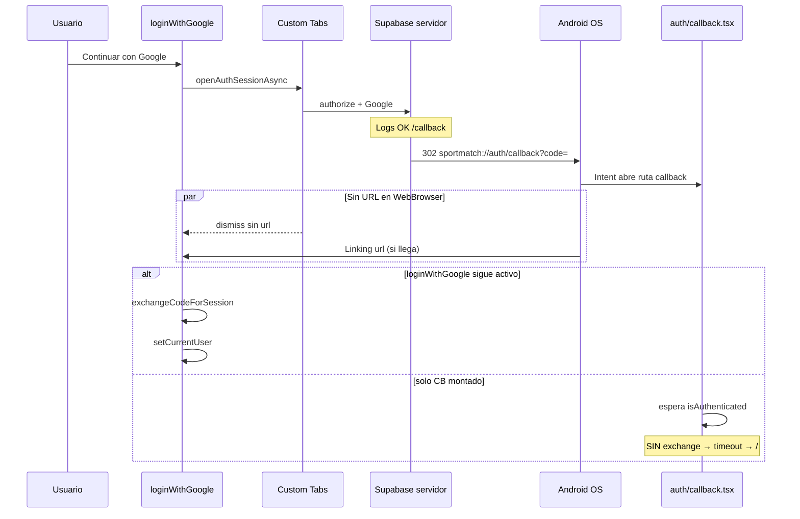

# Auditoría OAuth Google — Android APK (fase actual, post-PKCE S256)

**Proyecto:** SportMatch · Expo SDK 54 · Supabase · React Native  
**Fecha:** 2026-05-21  
**Contexto confirmado por el equipo:** PKCE `s256`, `/authorize` y `/callback` en Supabase OK, provider Google OK. **El problema está en el retorno a la app y/o en la UI, no en Google Cloud ni en PKCE.**

> **Nota de código real (repo):** el polyfill actual es **`expo-crypto` + `react-native-get-random-values`** en `lib/supabase/polyfills.ts`. **`react-native-quick-crypto` fue retirado** porque crasheaba la app al abrir. No documentar quick-crypto como dependencia activa.

---

## 1. Diagnóstico más probable AHORA

### A. Confusión servidor vs cliente (la más importante)

Los logs de Supabase:

- `/authorize | request completed`
- `/callback | request completed` (provider: google, 302)

significan que **Google devolvió el control a Supabase** y GoTrue procesó el callback **en el servidor**.

**No significan** que la APK haya ejecutado:

```ts
exchangeCodeForSession(code)
```

ni que `currentUser` esté poblado.

Cadena real:

```text
[APK] signInWithOAuth → Custom Tabs → Google → Supabase /callback (SERVIDOR OK en logs)
     → 302 a sportmatch://auth/callback?code=XXX
     → ¿llega a JS? → exchangeCodeForSession → AsyncStorage → setCurrentUser
```

**Cuello de botella actual:** paso `sportmatch://…?code=` → **JS de la app**.

---

### B. Custom Tabs cierra sin URL → Promise OAuth falla (muy probable)

Archivo: `lib/auth/open-oauth-session.ts`

- `WebBrowser.openAuthSessionAsync` en Android a menudo devuelve `dismiss` **sin** `url`.
- Se espera 12s (`DISMISS_GRACE_MS`) a que `Linking` entregue el deep link.
- Si el deep link abre **otra ruta** (`/auth/callback`) pero **no** dispara el listener a tiempo, o el usuario vuelve a `/` antes del exchange → **login falla en UI** aunque Supabase ya haya registrado el intento en servidor.

---

### C. `app/auth/callback.tsx` NO canjea el código (bug de diseño)

Archivo: `app/auth/callback.tsx`

- Solo muestra spinner y espera `isAuthenticated` (`currentUser !== null`).
- **No llama** `completeOAuthFromRedirectUrl`.
- Comentario asume que `loginWithGoogle` siempre sigue en ejecución.

**Fallo si:**

1. Deep link abre la app en `/auth/callback` (cold start o navegación Router).
2. `loginWithGoogle` ya no está esperando (timeout, dismiss, pantalla destruida).
3. El `code` nunca se intercambia → sesión no en cliente → `isAuthenticated` false → timeout 8s → `router.replace('/')` → **vuelves al login**.

Esto encaja con: **Supabase OK en dashboard, app en login**.

---

### D. `isAuthenticated` ≠ sesión Supabase (UI)

Archivo: `lib/app-provider.tsx`

```ts
isAuthenticated: currentUser !== null
```

- `exchangeCodeForSession` puede dejar **sesión en AsyncStorage**.
- Si `fetchProfileForUser` devuelve `null`, `hydrateFromSession` hace `setCurrentUser(null)` → UI muestra login aunque exista sesión auth.

Revisar en logs: `[Exchange] exchange OK` + `[Session] user id` + `[CURRENT USER] null` + `profile_missing`.

---

### E. `onAuthStateChange` incompleto (riesgo medio)

Solo maneja `SIGNED_OUT` y `SIGNED_IN`. No loguea ni trata explícitamente:

- `INITIAL_SESSION`
- `TOKEN_REFRESHED`
- `USER_UPDATED`

Tras OAuth, lo crítico es `SIGNED_IN` → `hydrateFromSession`. Si el evento llega antes del exchange, puede haber ventana rara.

---

### F. Sin selector de cuentas Google “visualmente” (UX en Custom Tabs)

Si `/authorize` carga pero no ves picker:

- Cuenta Google ya en cookie en Custom Tabs (login silencioso).
- Pantalla Supabase intermedia cargando (no es pantalla de Google).
- Custom Tabs no muestra UI (pantalla en blanco) pero el flujo sigue en servidor.

**No contradice** logs Supabase exitosos.

---

## 2. Archivos problemáticos / críticos (lista exacta)

| Prioridad | Archivo | Problema |
|-----------|---------|----------|
| P0 | `lib/auth/open-oauth-session.ts` | Retorno Android depende de Linking + grace timer |
| P0 | `app/auth/callback.tsx` | No exchange en deep link; timeout manda a login |
| P0 | `lib/app-provider.tsx` | `isAuthenticated` = perfil DB, no sesión; `loginWithGoogle` único dueño del exchange |
| P1 | `lib/complete-oauth-redirect.ts` | Logs insuficientes; no verifica sesión post-exchange |
| P1 | `lib/app-provider.tsx` | `onAuthStateChange` parcial; sin logs de eventos |
| P2 | `app/index.tsx` | Gate solo mira `currentUser` |
| P2 | `lib/app-provider.tsx` | `hydrateFromSession` borra user si no hay perfil |
| OK | `lib/oauth-redirect.ts` | redirect URI centralizado |
| OK | `lib/supabase/client.ts` | singleton + pkce nativo |
| OK | `app.json` | intentFilters `sportmatch` / `auth` / `callback` |

**No tocar (ya OK):** Google Cloud Client IDs, SHA-1, PKCE S256, Supabase Redirect URLs (salvo verificar `redirect_to` en runtime).

---

## 3. Qué logs faltaban (antes de este informe)

| Tag | Estado previo | Añadido en parche |
|-----|---------------|------------------|
| `[OAuth]` | Parcial | timestamps, `result.type`, grace |
| `[DeepLink]` | Parcial | URL preview, source |
| `[Exchange]` | Básico | starting, code len, session user id, error stack |
| `[AuthState]` | No | evento + session present |
| `[Session]` | No | getSession tras exchange |
| `[Navigation]` | No | callback mount, replace |
| `[CURRENT USER]` | No | tras hydrate / loginWithGoogle |

Activar: `__DEV__` o `EXPO_PUBLIC_AUTH_DEBUG=1` en EAS.

```bash
adb logcat | grep -E '\[OAuth\]|\[DeepLink\]|\[Exchange\]|\[AuthState\]|\[Session\]|\[AuthCallback\]|\[Navigation\]'
```

---

## 4. Race conditions detectadas

| # | Condición | Efecto |
|---|-----------|--------|
| R1 | Deep link abre `/auth/callback` mientras `openOAuth` espera | Dos caminos; solo uno hace exchange si R3 no está parcheado |
| R2 | `onAuthStateChange(SIGNED_IN)` vs `loginWithGoogle` setCurrentUser | Doble hydrate; orden puede limpiar user si perfil falla una vez |
| R3 | `auth/callback` timeout 8s → `router.replace('/')` | Sale de callback antes de exchange si loginWithGoogle lento |
| R4 | `oauthInFlight` lock liberado al terminar `openOAuth` | Segundo tap Google bloqueado 12s — OK |
| R5 | Custom Tabs `dismiss` antes de `Linking` con `code` | Promise rechaza; servidor ya pudo completar /callback |

---

## 5. Errores silenciados / tragados

| Ubicación | Comportamiento |
|-----------|----------------|
| `open-oauth-session.ts` `warmUpAsync` / `coolDownAsync` | catch vacío (OK) |
| `loginWithGoogle` catch general | `fail(msg)` — usuario ve error si llega a UI |
| `hydrateFromSession` sin perfil | **Sin error visible** — `currentUser = null` |
| `product-analytics` / telemetry | catch vacío (no afecta auth) |
| `auth/callback` timeout | Navega a `/` **sin mensaje** |

---

## 6. Callbacks que podrían no resolverse

1. `WebBrowser.openAuthSessionAsync` → `dismiss` sin URL → tras 12s → `OAuthSessionError no_callback`.
2. `Linking` entrega URL **sin** `code` → ignorada por `oauthRedirectHasCredentials` → mismo timeout.
3. `exchangeCodeForSession` falla (verifier, code expirado) → `fail` con `oauth_step: exchange_code`.
4. Exchange OK pero `getUser()` null → fail explícito.
5. Exchange OK, user OK, `fetchProfileForUser` null → fail `profile_missing`.
6. Exchange nunca llamado en callback route → timeout 8s en `auth/callback` → login.

---

## 7. Flujo Android que se rompe (diagrama)



---

## 8. Parches recomendados (aplicados en repo tras este doc)

### P0 — Recovery en `app/auth/callback.tsx`

- Leer `Linking.getInitialURL()` y evento `url` en esa pantalla.
- Si hay `code`, llamar `completeOAuthFromRedirectUrl`.
- Evita depender solo de `loginWithGoogle` en background.

### P1 — Instrumentación

- `lib/auth/auth-debug.ts`: timestamps + tags `AuthState`, `Session`, `Navigation`.
- `lib/complete-oauth-redirect.ts`: logs `[Exchange] starting/success/session/error`.
- `lib/app-provider.tsx`: log todos los eventos `onAuthStateChange`.

### P2 — Ajustes opcionales si sigue fallando

- Subir `DISMISS_GRACE_MS` a 18–20s en APK lentos.
- Tras exchange OK en `loginWithGoogle`, `await supabase.auth.getSession()` y log explícito.
- Mostrar error en `auth/callback` si exchange falla (no solo spinner).
- Considerar `isAuthenticated` basado en sesión + perfil (cambio de producto).

---

## 9. Estrategia definitiva debugging APK

1. Build con `EXPO_PUBLIC_AUTH_DEBUG=1`.
2. Desinstalar app, instalar APK nuevo.
3. `adb logcat` filtrado (comando arriba).
4. Un solo intento Google; capturar secuencia:

```text
[OAuth] iniciando signInWithOAuth
[PKCE] method=s256
[OAuth] WebBrowser resultado type=...
[DeepLink] callback OAuth resuelto  ← SI NO APARECE, cuello de botella
[Exchange] starting
[Exchange] exchange OK
[Session] userId=...
[AuthState] SIGNED_IN
[CURRENT USER] profile id=...  ← SI NULL, problema DB/perfil
```

5. Comparar con Supabase Auth logs (servidor ≠ cliente).

6. Probar deep link manual:

```bash
adb shell am start -a android.intent.action.VIEW \
  -d "sportmatch://auth/callback?code=PEGAR_CODE_DE_PRUEBA" \
  com.pichanga.expo
```

(solo válido con code fresco; sirve para ver si callback route hace exchange)

---

## 10. Investigación por prioridad (checklist ejecutado en código)

| # | Área | Resultado |
|---|------|-----------|
| 1 | `openAuthSessionAsync` | Un listener por flujo; cleanup OK; riesgo dismiss sin URL |
| 2 | `completeOAuthFromRedirectUrl` | Exchange sí; faltaba log sesión post-exchange → **añadido** |
| 3 | Linking listeners | **Un solo** `addEventListener` en OAuth; ninguno global duplicado |
| 4 | AppProvider | `isAuthenticated` = `currentUser`; eventos auth parciales → **logs ampliados** |
| 5 | intentFilters | `app.json` OK `sportmatch` + host `auth` |
| 6 | Expo Router callback | **Gap P0** → parche recovery |
| 7 | APK vs Go | Mismo JS; nativo solo en APK (intents, Custom Tabs) |
| 8 | Instrumentación | **Ampliada** |
| 9 | UI vs sesión | **Hipótesis principal** si Exchange OK y user null |
| 10 | AsyncStorage | key `pichanga-auth`; verifier `pichanga-auth-code-verifier` |

---

## 11. Qué NO hacer en esta fase

- Reconfigurar Google Cloud / SHA-1 (salvo package distinto).
- Cambiar PKCE a implicit en Android.
- Reinstalar `react-native-quick-crypto` (crash al abrir).
- Reestructurar toda la arquitectura auth.

---

## 12. Archivos tocados por la implementación de seguimiento

| Archivo | Cambio |
|---------|--------|
| `lib/auth/auth-debug.ts` | Timestamps + tags Session/AuthState/Navigation |
| `lib/auth/complete-oauth-from-url.ts` | (nuevo) handler reutilizable callback |
| `lib/complete-oauth-redirect.ts` | Logs exchange detallados + getSession |
| `lib/auth/open-oauth-session.ts` | Logs ampliados |
| `app/auth/callback.tsx` | Recovery deep link + exchange |
| `lib/app-provider.tsx` | Logs onAuthStateChange |

---

## 13. Resultado esperado tras parches

1. Usuario pulsa Google → Custom Tabs.
2. Supabase/Google completan (como ahora en logs).
3. Deep link con `code` → **exchange en `loginWithGoogle` O en `auth/callback`**.
4. `[Exchange] exchange OK` + `[Session] userId`.
5. `setCurrentUser` o hydrate → `isAuthenticated` true.
6. Redirect a `/` y gate muestra home.

Si paso 3–4 fallan pero Supabase muestra callback OK → enfocar **intent filters / Linking / Custom Tabs**, no provider Google.
