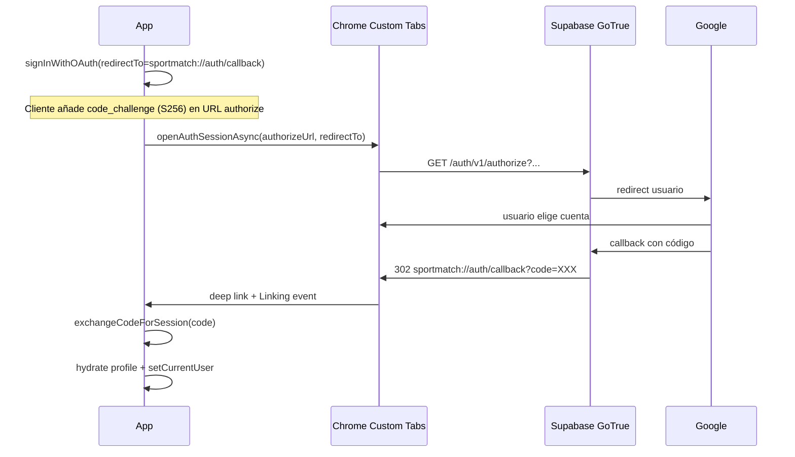

# Auditoría senior — Google OAuth + Supabase Auth en Expo React Native (Android APK)

**Proyecto:** SportMatch (`COPIAconExpo`)  
**Fecha:** 2026-05-18  
**Alcance:** Login con Google en APK release vs web React (misma instancia Supabase)  
**Autor del informe:** Revisión tipo arquitecto mobile / auth (basada en código en `main` al momento de redactar)

---

## Resumen ejecutivo

| Plataforma | Estado observado | Causa raíz más probable |
|------------|------------------|-------------------------|
| **Web React** | OK | Redirect HTTPS + `flowType: implicit` + navegador completo |
| **APK Android** | Falla | Cadena rota entre **Chrome Custom Tabs → Supabase `/authorize` → Google → deep link `sportmatch://`** |

**Síntoma que reportas ahora:** al pulsar Google se abre  
`https://fnrsjmgdlsrvpuqbcggm.supabase.co/auth/v1/authorize?provider=google&redirect_to=sportmatch%3A%2F%2Fauth%2Fcallback`, **no aparece selector de cuentas**, carga “infinito” y vuelves al login sin sesión.

Eso indica que el fallo ocurre **antes o durante** el paso Supabase → Google, **no** solo en el canje PKCE final (aunque ese paso también puede fallar después).

**Misma Supabase URL/anon key en web y móvil es correcto.** El problema no es “otro proyecto”, sino **mecanismo OAuth distinto** + **config Google Android** + **comportamiento Custom Tabs** + **bugs ya corregidos en código** que el APK instalado puede no tener aún.

---

## 1. Configuración Expo

### 1.1 Estado actual (`app.json` + `app.config.ts`)

| Campo | Valor actual | Evaluación |
|-------|--------------|------------|
| `scheme` | `sportmatch` | Correcto para deep links |
| `android.package` | `com.pichanga.expo` | Debe coincidir con Google OAuth Android |
| `ios.bundleIdentifier` | `com.pichanga.expo` | OK |
| `expo-router` plugin | `./app` | OK |
| `expo-web-browser` | plugin presente | Necesario |
| `expo-auth-session` | en `package.json`, **no** en plugins | OK vía dependencia |
| `intentFilters` explícitos | **No definidos** | Expo suele generarlos del `scheme`; en release conviene validar manifest |

**`app.config.ts`:** solo ajusta plugins Sentry; **no toca** `scheme` ni OAuth. Correcto.

### 1.2 Qué está bien

- Un solo esquema: `sportmatch` (alineado con `sportmatch://auth/callback`).
- `WebBrowser.maybeCompleteAuthSession()` en `lib/app-provider.tsx` (línea ~85).
- Ruta Expo Router `app/auth/callback.tsx` registrada en `app/_layout.tsx`.
- `newArchEnabled: false` (evita inestabilidad en builds nativos).

### 1.3 Qué falta o conviene añadir

1. **`android.intentFilters` explícitos** (recomendado en apps con OAuth en producción):

```json
"android": {
  "package": "com.pichanga.expo",
  "intentFilters": [
    {
      "action": "VIEW",
      "data": [
        {
          "scheme": "sportmatch",
          "host": "auth",
          "pathPrefix": "/callback"
        }
      ],
      "category": ["BROWSABLE", "DEFAULT"]
    }
  ]
}
```

Tras añadir: `npx expo prebuild --clean` solo para inspeccionar, o confiar en EAS; **nuevo build APK obligatorio**.

2. **Log del redirect URI en dev** al arrancar (una vez), para copiarlo a Supabase:

```ts
import { getOAuthRedirectUri } from './lib/oauth-redirect'
if (__DEV__) console.log('[OAuth] redirectUri=', getOAuthRedirectUri())
```

En APK release suele ser `sportmatch://auth/callback`. En Expo Go puede ser `exp://192.168.x.x:8081/--/auth/callback` — **deben estar ambos** en Supabase Redirect URLs si pruebas en Go y en APK.

3. **Plugin opcional** `expo-build-properties` si en el futuro necesitas forzar `compileSdk` / manifest merges; hoy no es bloqueante.

### 1.4 Qué eliminar / no mezclar

| Práctica | Por qué |
|----------|---------|
| `redirect_to` manual distinto de `openAuthSessionAsync` | Rompe el cierre de sesión en Custom Tabs |
| `Linking.createURL('/auth/callback')` en un sitio y `sportmatch://…` en otro | Misma URI en **tres** sitios: Supabase, WebBrowser, Linking |
| `skipBrowserRedirect: true` en **nativo** | Añade `skip_http_redirect=true` → pantalla en blanco / carga infinita en `/authorize` (corregido en código reciente) |
| `getInitialURL()` al iniciar OAuth | Resolvía `sportmatch://auth/callback` **sin** `?code=` y cerraba el flujo **antes** de abrir Google (corregido) |
| Redirect inmediato en `auth/callback` sin esperar sesión | Cortaba el canje del código (corregido) |

### 1.5 Deep linking — qué debe generar EAS (Android)

En `AndroidManifest.xml` (build EAS) deberías ver algo equivalente a:

```xml
<intent-filter>
  <action android:name="android.intent.action.VIEW" />
  <category android:name="android.intent.category.DEFAULT" />
  <category android:name="android.intent.category.BROWSABLE" />
  <data android:scheme="sportmatch" android:host="auth" android:pathPrefix="/callback" />
</intent-filter>
```

**Validación:** descargar APK/AAB, descomprimir, o revisar build logs; o probar:

```bash
adb shell am start -a android.intent.action.VIEW -d "sportmatch://auth/callback?code=test"
```

La app debe abrirse en ruta `/auth/callback` (aunque `code=test` falle en exchange).

---

## 2. Implementación OAuth (código actual)

### 2.1 Archivos involucrados

| Archivo | Rol |
|---------|-----|
| `lib/supabase/client.ts` | Cliente Supabase; **`flowType: pkce` en nativo**, `implicit` en web |
| `lib/oauth-redirect.ts` | `makeRedirectUri()` + validación URL con credenciales |
| `lib/complete-oauth-redirect.ts` | `setSession` o `exchangeCodeForSession` |
| `lib/app-provider.tsx` | `loginWithGoogle`, `openOAuthAndResolveCallbackUrl` |
| `components/auth-screen.tsx` | UI; muestra `res.error` si falla |
| `app/auth/callback.tsx` | Pantalla intermedia post deep link |

### 2.2 Flujo esperado (nativo, PKCE) — qué debería pasar



### 2.3 Análisis de tu URL de authorize (síntoma “carga infinita”)

URL reportada:

```text
https://fnrsjmgdlsrvpuqbcggm.supabase.co/auth/v1/authorize?provider=google&redirect_to=sportmatch%3A%2F%2Fauth%2Fcallback
```

**Observaciones críticas:**

1. **No ves `code_challenge` / `code_challenge_method` en lo que pegaste**  
   - Si el APK fue compilado **con** `flowType: 'pkce'` (código actual en `client.ts`), la URL real debería incluir algo como `code_challenge=...&code_challenge_method=S256`.  
   - Si **no** los lleva, o el build es viejo, o `signInWithOAuth` no está usando el mismo cliente Supabase instanciado con PKCE.

2. **Quedarse en `/authorize` sin llegar a Google** suele ser:
   - **`skip_http_redirect=true`** en builds antiguos (respuesta no redirige bien en Custom Tabs).
   - **Google provider mal configurado** en Supabase (Client ID/Secret web incorrectos).
   - **Redirect URL `sportmatch://auth/callback` no permitida** exactamente en Supabase (tú la tienes; verificar sin typo).
   - **Pantalla de consentimiento Google** en modo “Testing” sin tu email como test user (suele dar error, no siempre infinito).
   - **Redirección intermedia rota** hacia `sportmatch.cl` en lugar de app (menos probable si la barra es solo supabase.co).

3. **`redirect_to=sportmatch://auth/callback`** está bien codificado (`%3A%2F%2F` = `://`). Coincide con tu allow list.

### 2.4 Code review — hallazgos en implementación

#### Correcto (post-fixes recientes en repo)

- `getOAuthRedirectUri()` centraliza redirect (expo-auth-session).
- `skipBrowserRedirect: Platform.OS === 'web'` en nativo.
- Listener `Linking` + margen 10s si Custom Tabs hace `dismiss` sin URL.
- `oauthRedirectHasCredentials()` evita falsos callbacks vacíos.
- `completeOAuthFromRedirectUrl()` unifica PKCE e implicit.
- `auth/callback` espera `isAuthenticated` antes de mandar al login.

#### Riesgos / deuda técnica aún presentes

| # | Riesgo | Severidad | Detalle |
|---|--------|-----------|---------|
| 1 | OAuth dentro de `AppProvider` monolítico | Media | Difícil de testear; errores se pierden en UI si no se muestran |
| 2 | `onAuthStateChange` no maneja `TOKEN_REFRESHED` explícitamente | Baja | Suele bastar con `getSession` inicial |
| 3 | Perfil en DB obligatorio tras OAuth | Alta si aplica | Si `fetchProfileForUser` devuelve null → login “falla” **después** de Google OK |
| 4 | Sin telemetría del `authorizeUrl` completo en producción | Media | Dificulta soporte; recomendado log sanitizado |
| 5 | Race: deep link abre `auth/callback` mientras `loginWithGoogle` aún corre | Media | Mitigado con espera en callback screen |
| 6 | Un solo `redirectTo` en Supabase | Alta | Si `makeRedirectUri()` en release ≠ `sportmatch://auth/callback` literal, falla |

#### Anti-patrón histórico (causa de “no veo emails”)

```ts
// MAL (ya eliminado en main): getInitialURL() al inicio del OAuth
void Linking.getInitialURL().then((initial) => {
  if (initial) finish(initial) // sportmatch://auth/callback SIN code → falla rápido
})
```

### 2.5 Web vs nativo — diferencia de cliente Supabase

```ts
// lib/supabase/client.ts
flowType: Platform.OS === 'web' ? 'implicit' : 'pkce',
detectSessionInUrl: Platform.OS === 'web',
```

| | Web | APK |
|---|-----|-----|
| Flujo | Implicit (tokens en hash/URL) | **PKCE** (`code` en query) |
| Redirect | `https://sportmatch.cl/...` | `sportmatch://auth/callback?code=` |
| Session en URL | A veces auto (`detectSessionInUrl`) | **Manual** (`exchangeCodeForSession`) |
| Navegador | Misma pestaña | Custom Tabs + app en segundo plano |

**Conclusión:** que web funcione **no prueba** que el APK esté bien configurado.

---

## 3. Android release build vs Expo Go

| Aspecto | Expo Go | APK EAS (preview/production) |
|---------|---------|--------------------------------|
| Package name | `host.exp.exponent` | `com.pichanga.expo` |
| Scheme / redirect | `exp://IP:8081/--/auth/callback` | `sportmatch://auth/callback` |
| Google OAuth Android client | No usa tu SHA-1 de release | **Requiere** cliente Android + SHA-1 EAS |
| JS bundle | Metro en vivo | Bundle embebido (código del commit del build) |
| Env vars | `.env` local / EAS env | **EAS `preview` env** (`EXPO_PUBLIC_*`) |

**Errores típicos:**

- Probar OAuth en **Expo Go** con config pensada para APK → redirect URI distinto.
- APK compilado **antes** de fixes OAuth → comportamiento distinto al repo actual.
- Variables `EXPO_PUBLIC_SUPABASE_*` solo en `.env.local` y **no** en EAS Environment → APK sin Supabase correcto (síntoma: fallos raros, no siempre infinito en authorize).

**Checklist release:**

- [ ] Build con commit que incluye `oauth-redirect.ts`, `complete-oauth-redirect.ts`, fixes `skipBrowserRedirect` y Linking.
- [ ] `eas.json` profile `preview`: variables `EXPO_PUBLIC_SUPABASE_URL` y `EXPO_PUBLIC_SUPABASE_ANON_KEY`.
- [ ] Instalar APK **nuevo** tras cada cambio auth.
- [ ] Probar en dispositivo físico (no solo emulador).

---

## 4. Google Cloud Console

### 4.1 Qué debe existir (mínimo)

| Cliente | Tipo | Uso |
|---------|------|-----|
| **sportmatch** (web) | Aplicación web | Supabase Dashboard → Google → Client ID + **Secret** |
| **SportMatch APK** | Android | Validación app por `com.pichanga.expo` + **SHA-1** |

### 4.2 Android client

| Campo | Valor exacto |
|-------|----------------|
| Package name | `com.pichanga.expo` |
| SHA-1 | Certificado **EAS Upload keystore** (expo.dev → Project → Credentials → Android) |

**Cómo validar SHA-1:**

```bash
# En máquina, si exportas keystore EAS (o desde panel Expo copiar SHA-1)
keytool -list -v -keystore your.keystore -alias your-alias
```

Comparar con huella en Google Cloud. **SHA-1 de debug local ≠ SHA-1 de EAS** → Google falla en APK release.

### 4.3 Web client — URIs de redirección autorizados

Debe incluir **obligatoriamente**:

```text
https://fnrsjmgdlsrvpuqbcggm.supabase.co/auth/v1/callback
```

(O la URL que muestra Supabase en Authentication → Google → Callback URL.)

**No** pongas `sportmatch://` en el cliente **web** de Google; eso va en **Supabase Redirect URLs**, no en Google web URIs.

### 4.4 Supabase → Google: Client IDs

En Supabase Authentication → Google → **Client IDs** (campo puede listar varios):

```text
WEB_CLIENT_ID.apps.googleusercontent.com,ANDROID_CLIENT_ID.apps.googleusercontent.com
```

- **Secret:** solo del cliente **web**.
- Si solo está el web ID, el flujo nativo puede fallar o comportarse distinto.

### 4.5 Cómo detectar si Google Cloud está roto

| Síntoma | Causa probable |
|---------|----------------|
| Carga infinita en `supabase.co/authorize` | `skip_http_redirect`, Supabase Google misconfig |
| `redirect_uri_mismatch` | URI en Google web no incluye `/auth/v1/callback` |
| `Error 400: invalid_client` | Client ID/Secret incorrectos en Supabase |
| No aparece selector de cuentas | No llega a Google; bloqueo en Supabase |
| Tras elegir cuenta, vuelve login sin error visible | Deep link o `exchangeCodeForSession` o perfil DB |

---

## 5. Supabase Auth

### 5.1 Tu configuración reportada

**Redirect URLs:** correctas para web + app (incluye wildcard web y `sportmatch://auth/callback`).

**Site URL:** `https://www.sportmatch.cl` — OK para web; en móvil el `redirect_to` explícito es el que manda el SDK (`sportmatch://auth/callback`).

### 5.2 PKCE en móvil (S256)

Con `flowType: 'pkce'` el cliente Supabase:

1. Genera `code_verifier` y guarda en **AsyncStorage** (storage key auth).
2. Añade `code_challenge` + `code_challenge_method=S256` a `/authorize`.
3. Tras redirect, `exchangeCodeForSession(code)` envía verifier + code al endpoint token.

**Si falla el paso 3:** verás Google y a veces incluso elegir cuenta, pero al volver no hay sesión.

**Si falla antes del paso 3 (tu caso actual):** no llegas a Google.

### 5.3 `redirectTo` — regla de oro

Debe cumplirse **literalmente**:

```text
redirectTo (signInWithOAuth) === redirectUri (openAuthSessionAsync) === entrada en Supabase allow list
```

Código actual usa `getOAuthRedirectUri()` para los tres. **Verificar en runtime** que en APK release el valor es exactamente `sportmatch://auth/callback`.

### 5.4 `detectSessionInUrl: false` en nativo

Correcto: el deep link no lo procesa automáticamente el SDK; lo hace tu código con `completeOAuthFromRedirectUrl`.

### 5.5 Punto probable de fallo según síntoma

| Fase | Tu síntoma | Probabilidad |
|------|------------|--------------|
| A. URL authorize sin ir a Google | Carga infinita en Supabase | **ALTA** |
| B. Google OK, sin deep link | Vuelve login, sin error | Media |
| C. Deep link OK, exchange falla | Mensaje error / login | Media |
| D. Sesión OK, sin perfil DB | Error perfil faltante | Media en cuentas nuevas |

Estás en **fase A** (y posiblemente builds sin últimos fixes).

---

## 6. Debugging profesional

### 6.1 Logs recomendados (temporal, sanitizados)

En `loginWithGoogle` **antes** de `signInWithOAuth`:

```ts
const redirectTo = getOAuthRedirectUri()
console.log('[OAuth] platform=', Platform.OS)
console.log('[OAuth] redirectTo=', redirectTo)
```

Tras `signInWithOAuth`:

```ts
console.log('[OAuth] authorizeUrl host=', new URL(data.url).host)
console.log('[OAuth] authorize has code_challenge=', data.url.includes('code_challenge'))
console.log('[OAuth] authorize has skip_http_redirect=', data.url.includes('skip_http_redirect'))
```

En `openOAuthAndResolveCallbackUrl` → `finish`:

```ts
console.log('[OAuth] callback url length=', url.length)
console.log('[OAuth] has code=', url.includes('code='))
console.log('[OAuth] has access_token=', url.includes('access_token='))
```

Tras exchange:

```ts
const { data: { session } } = await supabase.auth.getSession()
console.log('[OAuth] session user id=', session?.user?.id ?? 'null')
```

En `auth-screen.tsx` ya muestras `res.error`; asegúrate de leer el texto bajo el botón Google.

### 6.2 Ver logs en APK release

```bash
adb logcat | grep -iE "OAuth|Supabase|auth|ReactNativeJS"
```

O Metro no aplica en release; usa `adb` o Sentry breadcrumbs.

### 6.3 Probar deep link manualmente

```bash
adb shell am start -W -a android.intent.action.VIEW \
  -d "sportmatch://auth/callback?code=FAKE" \
  com.pichanga.expo
```

- App abre → intent filter OK.
- `code=FAKE` → error en exchange (esperado).

### 6.4 Probar redirect URI en dispositivo

Añadir botón dev-only que haga `Alert.alert(getOAuthRedirectUri())` y copiar valor a Supabase allow list.

### 6.5 Inspeccionar respuesta de authorize (avanzado)

En Custom Tabs es difícil; alternativa temporal en **dev build**:

- Abrir `data.url` en navegador desktop con mismos query params y ver si redirige a Google.

### 6.6 Checklist de una prueba OAuth limpia

1. Desinstalar app.
2. Instalar APK del último EAS build.
3. Confirmar EAS env vars Supabase.
4. Confirmar Google Android SHA-1 + package.
5. Confirmar Supabase Client IDs = web + android.
6. Pulsar Google → **debe** verse cuenta Google en < 5 s.
7. Tras elegir cuenta → breve spinner en `auth/callback` → home logueado.
8. Si falla, capturar **texto de error** en pantalla login + `adb logcat`.

---

## 7. Estructura ideal (práctica moderna 2026)

### 7.1 Arquitectura recomendada

```text
lib/auth/
  oauth-redirect.ts      # makeRedirectUri, validadores
  oauth-session.ts       # completeOAuthFromRedirectUrl
  google-sign-in.ts      # orquestación: browser + linking
  use-google-auth.ts     # hook delgado para UI
app/auth/callback.tsx    # UI loading + fallback redirect
```

`AppProvider` solo consume `useGoogleAuth()` / eventos `onAuthStateChange`, no implementa OAuth inline.

### 7.2 Patrón Supabase oficial (Expo + PKCE)

```ts
import * as WebBrowser from 'expo-web-browser'
import * as Linking from 'expo-linking'
import { makeRedirectUri } from 'expo-auth-session'
import { createClient } from './supabase'

WebBrowser.maybeCompleteAuthSession()

const supabase = createClient(url, key, {
  auth: {
    storage: AsyncStorage,
    flowType: 'pkce',
    detectSessionInUrl: false,
    persistSession: true,
  },
})

const redirectTo = makeRedirectUri({
  scheme: 'sportmatch',
  path: 'auth/callback',
})

export async function signInWithGoogle() {
  const { data, error } = await supabase.auth.signInWithOAuth({
    provider: 'google',
    options: {
      redirectTo,
      skipBrowserRedirect: false, // nativo
    },
  })
  if (error) throw error

  const result = await WebBrowser.openAuthSessionAsync(data.url!, redirectTo)
  if (result.type !== 'success' || !result.url) {
    throw new Error('OAuth cancelado')
  }

  const { error: exchangeError } = await supabase.auth.exchangeCodeForSession(
    parseCodeFromUrl(result.url)
  )
  if (exchangeError) throw exchangeError
}
```

Tu código actual va **más allá** (Linking listener + warmUp), lo cual es correcto para Android problemático.

### 7.3 Alternativa enterprise (si Supabase OAuth sigue fallando)

**`@react-native-google-signin/google-signin`** → obtienes `idToken` nativo → `supabase.auth.signInWithIdToken({ provider: 'google', token })`.

Ventajas: UX nativa, sin Custom Tabs. Requiere otro wiring en Supabase (habilitar ID token). Valorar si el producto lo exige.

---

## 8. Checklist acción inmediata (orden recomendado)

### Configuración (sin código)

- [ ] Google Cloud: cliente **Android** con `com.pichanga.expo` + SHA-1 **EAS**.
- [ ] Google Cloud: cliente **Web** con redirect `https://fnrsjmgdlsrvpuqbcggm.supabase.co/auth/v1/callback`.
- [ ] Supabase Google: **dos** Client IDs (web,android) separados por coma.
- [ ] Supabase Redirect URLs: incluir `sportmatch://auth/callback` (ya está).
- [ ] EAS Secrets / env: `EXPO_PUBLIC_SUPABASE_URL`, `EXPO_PUBLIC_SUPABASE_ANON_KEY` en profile `preview`.

### Código / build

- [ ] Confirmar que el APK se construye desde commit con fixes OAuth (ver historial git reciente en `lib/app-provider.tsx`, `lib/oauth-redirect.ts`).
- [ ] `npx eas-cli build --platform android --profile preview`.
- [ ] Instalar APK nuevo; no reutilizar build anterior.

### Validación

- [ ] authorize URL debe incluir `code_challenge` (PKCE).
- [ ] authorize URL **no** debe incluir `skip_http_redirect=true` en nativo.
- [ ] Tras login, `getSession()` debe devolver usuario.

---

## 9. Commits recientes relevantes (referencia)

Busca en `main` mensajes del estilo:

- `fix(auth): ruta OAuth /auth/callback`
- `fix(auth): alinear callback OAuth en APK con WebBrowser`
- `fix(auth): OAuth Google en APK con PKCE + exchangeCodeForSession`
- `fix(auth): Android OAuth — completar sesión vía Linking`
- `fix(auth): OAuth Google nativo sin skip_http_redirect`

Si el APK se generó **antes** de estos commits, el informe de código no coincide con el binario instalado.

---

## 10. Conclusión del auditor

**No es un problema de “usar la misma Supabase” en web y móvil.** Es un problema de **pipeline OAuth móvil**:

1. **Custom Tabs + `/authorize`** mal servido si `skip_http_redirect` (build viejo) → **carga infinita sin cuentas Google**.
2. **Google Cloud Android** (SHA-1 + package) obligatorio para APK; web no lo necesita.
3. **PKCE + deep link + exchange** deben ejecutarse en serie; cualquier eslabón roto devuelve al login.
4. **Perfil en Postgres** puede hacer fallar el login incluso con sesión válida.

**Prioridad #1:** APK nuevo con código actual + validar en log que `authorize` lleva `code_challenge` y **no** lleva `skip_http_redirect`.  
**Prioridad #2:** Supabase Google Client IDs = Web + Android.  
**Prioridad #3:** SHA-1 EAS en Google Android client.

---

## Anexo — Variables de entorno (EAS)

| Variable | Build APK |
|----------|-----------|
| `EXPO_PUBLIC_SUPABASE_URL` | Obligatoria en EAS env `preview` |
| `EXPO_PUBLIC_SUPABASE_ANON_KEY` | Obligatoria en EAS env `preview` |
| `SENTRY_DISABLE_AUTO_UPLOAD` | Ya en `eas.json` (no afecta OAuth) |

`.env.local` **no** se embebe en EAS build salvo que esté configurado en el dashboard Expo.
