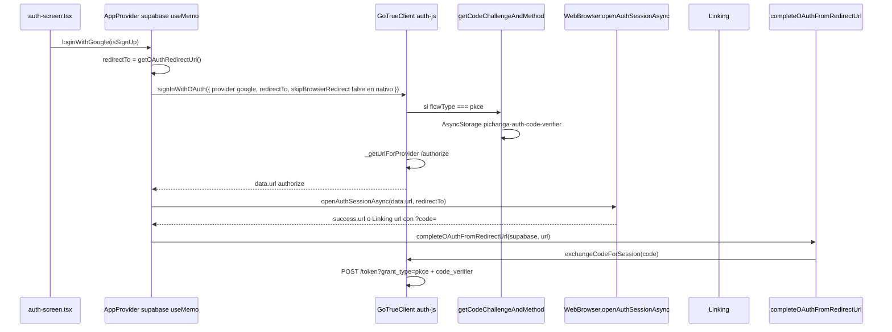

# Auditoría PKCE — Cliente Supabase REAL y flujo Google OAuth (Android)

**Proyecto:** SportMatch (`COPIAconExpo`)  
**Fecha:** 2026-05-20  
**Hallazgo clave del usuario:** la URL `/authorize` muestra `code_challenge_method=plain` y no `S256` / `s256`.

Este documento traza el flujo **real del código en el repo**, no teoría genérica.

---

## Veredicto en una línea

**PKCE sí está activo en Android** (`flowType: 'pkce'`).  
**`code_challenge_method=plain` NO significa que PKCE esté desactivado** ni que uses `implicit`.  
Significa que **`@supabase/auth-js` no pudo usar `crypto.subtle` (SHA-256) en el runtime de React Native** y degradó el challenge a **PKCE método `plain`** (válido en RFC 7636, pero distinto de `s256`).

La causa más probable en tu APK: **falta de Web Crypto (`crypto.subtle`) en Hermes**, no un segundo cliente Supabase ni código antiguo sin PKCE.

---

## 1. Cuántos `createClient()` existen

### 1.1 Definición (una sola)

| Archivo | Función |
|---------|---------|
| `lib/supabase/client.ts` | `export function createClient(): SupabaseClient` |

No hay otro `createClient` de Supabase en el proyecto. Todo importa desde `./supabase/client` o `../lib/supabase/client` o `@/lib/supabase/client`.

### 1.2 Llamadas a `createClient()` (instancias nuevas en cada llamada)

Cada `createClient()` ejecuta `createSupabaseClient(url, key, { auth: { … } })` y devuelve un **objeto nuevo** (nuevo `GoTrueClient` interno), pero **comparten**:

- `storage: AsyncStorage`
- `storageKey: 'pichanga-auth'`

| Archivo | Nº aprox. de llamadas |
|---------|----------------------|
| `lib/app-provider.tsx` | **1** (dentro de `useMemo`) |
| `lib/telemetry/product-analytics.ts` | 1 (si no hay override) |
| `lib/telemetry/bootstrap.tsx` | 3 |
| `lib/push/bootstrap.tsx` | 3 |
| `components/teams-screen.tsx` | 4 |
| `components/matches-hub-screen.tsx` | 4 |
| `components/create-match-screen.tsx` | 4 |
| `components/chat-screen.tsx` | 6 |
| `components/onboarding-screen.tsx` | 1 |
| `components/venue-dashboard-screen.tsx` | 7 |
| `components/venue-centro-screen.tsx` | 1 |
| `components/admin-dashboard-screen.tsx` | 3 |
| `components/match-detail-screen.tsx` | 3 |
| `src/features/explore/hooks/use-public-venues.ts` | 1 |
| `app/centro/[venueId].tsx` | 1 |
| `lib/use-match-participant-counts.ts` | 1 |

**Total:** ~40 llamadas en runtime, **1 factory**, **múltiples instancias** en paralelo.

### 1.3 ¿OAuth usa otro cliente distinto al “principal”?

**No.** El login Google usa **exclusivamente** la instancia de `AppProvider`:

```433:437:lib/app-provider.tsx
export function AppProvider({ children }: { children: ReactNode }) {
  const supabase = useMemo<SupabaseClient | null>(() => {
    if (!isSupabaseConfigured()) return null
    return createClient()
  }, [])
```

`loginWithGoogle` cierra sobre esa variable:

```776:778:lib/app-provider.tsx
  const loginWithGoogle = useCallback(
    async (isSignUp: boolean): Promise<LoginResult> => {
      if (!isSupabaseConfigured() || !supabase) {
```

```830:831:lib/app-provider.tsx
        const { data, error } = await supabase.auth.signInWithOAuth({
          provider: 'google',
```

```864:866:lib/app-provider.tsx
        const oauthDone = await completeOAuthFromRedirectUrl(
          supabase,
          authCallbackUrl
```

**Misma instancia** para: `signInWithOAuth` → guardar `code_verifier` → `exchangeCodeForSession`.

Las otras pantallas que llaman `createClient()` localmente **no participan** en `loginWithGoogle`, salvo que en el futuro llamen `signInWithOAuth` (hoy no lo hacen).

### 1.4 Riesgo real de múltiples instancias (no es tu síntoma `plain`)

- Varias instancias comparten `pichanga-auth-code-verifier` en AsyncStorage.
- Si **otra** instancia ejecutara `signInWithOAuth` o `getCodeChallengeAndMethod` **durante** tu login, podría **sobrescribir** el verifier.
- En este repo, **solo** `loginWithGoogle` dispara OAuth Google → riesgo bajo en la práctica actual.

---

## 2. Configuración auth del cliente REAL (`lib/supabase/client.ts`)

```75:88:lib/supabase/client.ts
  return createSupabaseClient(url, key, {
    auth: {
      storage: AsyncStorage,
      persistSession: true,
      autoRefreshToken: true,
      detectSessionInUrl: Platform.OS === 'web',
      storageKey,
      flowType: Platform.OS === 'web' ? 'implicit' : 'pkce',
    },
  })
```

| `Platform.OS` en APK | `flowType` | `detectSessionInUrl` |
|----------------------|------------|----------------------|
| `android` / `ios` | **`pkce`** | `false` |
| `web` | `implicit` | `true` |

**Evaluación en tiempo de ejecución:** `Platform.OS` se lee **cada vez** que alguien llama `createClient()`, no solo en web. En APK Android siempre es `'android'` → **`pkce`**.

**No hay** en el repo:

- Otro `flowType: 'implicit'` para móvil
- Cliente Supabase legacy en otro paquete
- Import directo de `@supabase/supabase-js` con `createClient` fuera de `lib/supabase/client.ts`

Default del SDK si no pasas opciones (`@supabase/supabase-js` → `DEFAULT_AUTH_OPTIONS`):

```28:33:node_modules/@supabase/supabase-js/src/lib/constants.ts
export const DEFAULT_AUTH_OPTIONS: SupabaseAuthClientOptions = {
  autoRefreshToken: true,
  persistSession: true,
  detectSessionInUrl: true,
  flowType: 'implicit',
}
```

Tu wrapper **sobrescribe** eso en nativo → no aplica el default `implicit` en Android.

---

## 3. ¿Un solo `AppProvider`?

| Ubicación | Cantidad |
|-----------|----------|
| `lib/app-provider.tsx` | `export function AppProvider` — **única definición** |
| `app/_layout.tsx` | **único** `<AppProvider>` en el árbol raíz |

No hay segundo provider ni fork del contexto auth.

---

## 4. Trazado del flujo REAL (botón → callback)



### Paso a paso con archivos y líneas

| # | Paso | Archivo | Qué ocurre |
|---|------|---------|------------|
| 1 | Tap Google | `components/auth-screen.tsx` ~148 | `loginWithGoogle(isSignUp)` vía `useApp()` |
| 2 | Redirect URI | `lib/oauth-redirect.ts` | `getOAuthRedirectUri()` → `makeRedirectUri({ scheme: 'sportmatch', path: 'auth/callback' })` |
| 3 | OAuth start | `lib/app-provider.tsx` ~829-841 | `supabase.auth.signInWithOAuth({ provider: 'google', options: { redirectTo, skipBrowserRedirect: web only, queryParams } })` |
| 4 | **Generación URL authorize** | `node_modules/@supabase/auth-js` | Ver §5 — **no es código tuyo** |
| 5 | Abrir navegador | `lib/app-provider.tsx` `openOAuthAndResolveCallbackUrl` | `WebBrowser.openAuthSessionAsync(oauthBrowserUrl, redirectTo)` + listener `Linking` en nativo |
| 6 | Deep link | Sistema Android | `sportmatch://auth/callback?code=…` → puede montar `app/auth/callback.tsx` |
| 7 | Canje sesión | `lib/complete-oauth-redirect.ts` | `exchangeCodeForSession(code)` en la **misma** instancia `supabase` |
| 8 | Perfil app | `lib/app-provider.tsx` | `getUser()` + `fetchProfileForUser` + `setCurrentUser` |

**`app/auth/callback.tsx`:** pantalla de espera; el canje del código lo hace **`loginWithGoogle`**, no esta pantalla.

---

## 5. Qué archivo genera la URL `/authorize`

**Generador:** `@supabase/auth-js` → `GoTrueClient._handleProviderSignIn` → `_getUrlForProvider`.

```4435:4457:node_modules/@supabase/auth-js/src/GoTrueClient.ts
  private async _handleProviderSignIn(...) {
    const url: string = await this._getUrlForProvider(`${this.url}/authorize`, provider, {
      redirectTo: options.redirectTo,
      scopes: options.scopes,
      queryParams: options.queryParams,
    })
    ...
    return { data: { provider, url }, error: null }
  }
```

```5063:5073:node_modules/@supabase/auth-js/src/GoTrueClient.ts
    if (this.flowType === 'pkce') {
      const [codeChallenge, codeChallengeMethod] = await getCodeChallengeAndMethod(
        this.storage,
        this.storageKey
      )
      const flowParams = new URLSearchParams({
        code_challenge: `${encodeURIComponent(codeChallenge)}`,
        code_challenge_method: `${encodeURIComponent(codeChallengeMethod)}`,
      })
      urlParams.push(flowParams.toString())
    }
```

**Condición para que aparezcan `code_challenge` y `code_challenge_method`:** `this.flowType === 'pkce'`.

Si en tu URL **ves** `code_challenge` + `code_challenge_method=plain` → **PKCE está activo** en esa build.

Si **no** ves ningún `code_challenge` → entonces sí sería `implicit` o build sin `flowType: pkce` (APK viejo o `Platform.OS === 'web'` por error).

### Sobre `skipBrowserRedirect` en tu código

```834:839:lib/app-provider.tsx
            skipBrowserRedirect: Platform.OS === 'web',
```

En **auth-js 2.100.1**, `_handleProviderSignIn` **no pasa** `skipBrowserRedirect` a `_getUrlForProvider`, así que **`skip_http_redirect` no se añade** vía `signInWithOAuth` en móvil. Eso coincide con una URL authorize “limpia” (solo provider, redirect_to, pkce).

---

## 6. Por qué aparece `code_challenge_method=plain` (causa exacta)

### 6.1 Lógica en `@supabase/auth-js` (código que corre en tu APK)

```283:312:node_modules/@supabase/auth-js/src/lib/helpers.ts
export async function generatePKCEChallenge(verifier: string) {
  const hasCryptoSupport =
    typeof crypto !== 'undefined' &&
    typeof crypto.subtle !== 'undefined' &&
    typeof TextEncoder !== 'undefined'

  if (!hasCryptoSupport) {
    console.warn(
      'WebCrypto API is not supported. Code challenge method will default to use plain instead of sha256.'
    )
    return verifier
  }
  const hashed = await sha256(verifier)
  return btoa(hashed).replace(/\+/g, '-').replace(/\//g, '_').replace(/=+$/, '')
}

export async function getCodeChallengeAndMethod(...) {
  ...
  const codeChallenge = await generatePKCEChallenge(codeVerifier)
  const codeChallengeMethod = codeVerifier === codeChallenge ? 'plain' : 's256'
  return [codeChallenge, codeChallengeMethod]
}
```

| Condición | `code_challenge` | `code_challenge_method` |
|-----------|------------------|-------------------------|
| Sin `crypto.subtle` | **igual al verifier** (texto plano) | **`plain`** |
| Con `crypto.subtle` | base64url(SHA256(verifier)) | **`s256`** (minúsculas, no `S256`) |

**Tu observación (`plain`) encaja al 100% con:** `hasCryptoSupport === false` en React Native (Hermes).

### 6.2 Qué NO es la causa

| Hipótesis incorrecta | Por qué |
|---------------------|---------|
| “PKCE no funciona” | Si no fuera PKCE, **no** habría `code_challenge` en la URL |
| “Usa `flowType: implicit` en Android” | El repo fuerza `pkce`; implicit no llama `getCodeChallengeAndMethod` en authorize |
| “Otro `createClient()` sin pkce hace el OAuth” | Solo `AppProvider.supabase` llama `signInWithOAuth` |
| “Debería decir `S256`” | El SDK emite **`s256`** en minúsculas (RFC); **`plain`** es otro método, no un typo de S256 |

### 6.3 Polyfills en tu proyecto hoy

| Import | Archivo | Efecto |
|--------|---------|--------|
| `react-native-url-polyfill/auto` | `lib/supabase/client.ts` | `URL` / URLSearchParams |
| **Ninguno** | — | **`crypto.subtle` no se polyfilla** |

`expo-crypto` aparece en `package-lock.json` como dependencia transitiva (`expo-auth-session`), pero **no se importa** en `lib/supabase/client.ts` ni en el entry de la app.

### 6.4 ¿`plain` rompe el login?

- **GoTrue / Supabase** acepta PKCE `plain` y `s256` si el verifier enviado en `/token?grant_type=pkce` coincide con la regla del método.
- Con `plain`, `code_challenge === code_verifier` en authorize; en exchange envías el mismo verifier → **debería canjear** si el flujo completa.
- Si fallas **antes** de ver cuentas Google, el problema es **authorize / Custom Tabs / Google / Supabase provider**, no el método `plain` en sí.

Si fallas **después** de elegir cuenta con error de exchange, entonces revisar verifier sobrescrito, timeout, o `AuthPKCECodeVerifierMissingError`.

---

## 7. URL authorize — checklist de parámetros

En Android con código actual del repo, la URL debería incluir **como mínimo**:

```text
https://<project>.supabase.co/auth/v1/authorize
  ?provider=google
  &redirect_to=<encodeURIComponent(getOAuthRedirectUri())>
  &code_challenge=<...>
  &code_challenge_method=plain   ← esperado en RN sin crypto.subtle
  [&prompt=consent si isSignUp]
```

| Parámetro | ¿Debe estar? | Tu caso |
|-----------|--------------|---------|
| `provider=google` | Sí | Sí |
| `redirect_to` | Sí | `sportmatch://auth/callback` (o `exp://…` en Expo Go) |
| `code_challenge` | Sí si `pkce` | Si lo ves → PKCE ON |
| `code_challenge_method` | `plain` o `s256` | **`plain` = sin Web Crypto** |
| `skip_http_redirect` | No en móvil con auth-js 2.100.1 vía signInWithOAuth | Normal que no aparezca |

---

## 8. ¿APK release con código antiguo?

### 8.1 Historial git relevante (`lib/supabase/client.ts`)

```text
5e938bd fix(auth): OAuth Google en APK con PKCE + exchangeCodeForSession
5fc1ca1 fix(auth): OAuth Google nativo sin skip_http_redirect
7637c4d fix(auth): Android OAuth — completar sesión vía Linking
9c4af36 fix(auth): OAuth Google en APK — redirect URI Expo y sin falso callback
```

Si el APK se generó **antes de `5e938bd`**, podría no tener `flowType: 'pkce'` → URL **sin** `code_challenge`.

Si el APK es **posterior** a `5e938bd` y aun así ves `code_challenge_method=plain`, eso es **consistente con código nuevo + RN sin `crypto.subtle`**, no con código antiguo.

### 8.2 Caché EAS

- EAS puede cachear dependencias npm; **no suele** servir JS de un commit viejo si el build apunta al commit correcto.
- **Validación obligatoria:** en [expo.dev](https://expo.dev) → tu build → **Commit hash** debe coincidir con `main` local (`9c4af36` o posterior).
- Tras cambios auth: `eas build --platform android --profile preview` **sin reutilizar** un APK descargado hace semanas.

### 8.3 Imports incorrectos

Todos los paths de Supabase apuntan a `lib/supabase/client.ts`. No hay `@/lib/supabase/client` duplicado con otra implementación. No hay `createBrowserClient` ni cliente Next en la app móvil.

---

## 9. Flujo `exchangeCodeForSession` (misma instancia + mismo storage)

```60:61:lib/complete-oauth-redirect.ts
  const { error } = await supabase.auth.exchangeCodeForSession(code)
```

Internamente (`auth-js`):

1. Lee AsyncStorage key: `pichanga-auth-code-verifier` (mismo `storageKey` que en `client.ts`).
2. `POST {supabaseUrl}/auth/v1/token?grant_type=pkce` con `auth_code` + `code_verifier`.

Ese verifier lo escribió `getCodeChallengeAndMethod` en el paso `signInWithOAuth` del **mismo** `GoTrueClient` (misma instancia `AppProvider`, mismo storage).

---

## 10. Logs concretos para confirmar en APK (sin teoría)

Añadir **temporalmente** en `loginWithGoogle` justo después de `signInWithOAuth`:

```ts
const u = new URL(data.url)
console.log('[PKCE-AUDIT] flowType esperado=pkce Platform=', Platform.OS)
console.log('[PKCE-AUDIT] authorize host=', u.host)
console.log('[PKCE-AUDIT] has code_challenge=', u.searchParams.has('code_challenge'))
console.log('[PKCE-AUDIT] method=', u.searchParams.get('code_challenge_method'))
console.log('[PKCE-AUDIT] crypto.subtle=', typeof globalThis.crypto?.subtle)
console.log('[PKCE-AUDIT] redirect_to=', u.searchParams.get('redirect_to'))
```

Interpretación:

| Log | Significado |
|-----|-------------|
| `method=plain` + `crypto.subtle=undefined` | Confirmado: falta polyfill Web Crypto |
| Sin `code_challenge` | `flowType` no es `pkce` en esa build o bug de cliente |
| `method=s256` | Web Crypto disponible (raro en RN sin polyfill) |
| `Platform=web` en APK | Algo muy raro (build web embebido); investigar |

En release:

```bash
adb logcat | grep -E "PKCE-AUDIT|WebCrypto API is not supported"
```

El warning de auth-js sale si `generatePKCEChallenge` usa fallback plain.

---

## 11. Corrección recomendada (habilitar `s256` en Android)

Objetivo: que `getCodeChallengeAndMethod` devuelva `s256`, no `plain`.

### Opción A — Polyfill Web Crypto (recomendada para Expo)

1. Instalar polyfill mantenido, p. ej. `expo-standard-webcrypto` o `react-native-quick-crypto` según compatibilidad con SDK 54.
2. Importarlo **antes** de cualquier uso de Supabase, idealmente primera línea de `lib/supabase/client.ts`:

```ts
import 'react-native-get-random-values' // si el polyfill lo requiere
import { polyfillWebCrypto } from 'expo-standard-webcrypto' // ejemplo
polyfillWebCrypto()

import 'react-native-url-polyfill/auto'
// ... resto
```

3. Rebuild APK y verificar log: `code_challenge_method=s256`.

### Opción B — Singleton Supabase (buena práctica, no arregla `plain` solo)

Reducir ~40 `createClient()` a una instancia exportada (`getSupabase()` memoizado) para evitar carreras en `code-verifier`. **Complementario**, no sustituto del polyfill.

---

## 12. Tabla diagnóstico vs síntomas

| Síntoma | Causa en ESTE proyecto |
|---------|------------------------|
| `code_challenge_method=plain` | RN sin `crypto.subtle`; auth-js fallback (§6) |
| Carga infinita en `/authorize` sin cuentas Google | Custom Tabs / Google provider / redirect Supabase; **no** explicado solo por `plain` |
| Vuelve login tras elegir cuenta | Deep link, exchange, o perfil DB faltante |
| Esperabas `S256` mayúsculas | SDK usa `s256` minúsculas; `plain` es método distinto |
| Web OK, APK mal | Web `implicit` sin PKCE en authorize; APK `pkce` + deep link + posible falta crypto |

---

## 13. Respuestas directas a tus 7 preguntas de investigación

| # | Pregunta | Respuesta en este repo |
|---|----------|------------------------|
| 1 | ¿Cuántos `createClient()`? | **1 definición**, ~40 llamadas que crean instancias distintas |
| 2 | ¿Qué cliente usa `loginWithGoogle`? | `AppProvider` → `useMemo(() => createClient())` |
| 3 | ¿Múltiples instancias? | Sí, pero OAuth solo en la de AppProvider |
| 4 | ¿Alguna con `implicit` en móvil? | **No** en `client.ts`; solo `web` |
| 5 | ¿APK con código antiguo? | Comprobar commit del build en EAS; `plain` **también** sale en código **nuevo** |
| 6 | ¿URL con `code_challenge` + S256? | `code_challenge` sí con pkce; método será **`s256` solo si hay `crypto.subtle`**, si no **`plain`** |
| 7 | ¿Por qué `plain`? | `generatePKCEChallenge` sin Web Crypto → `verifier === challenge` → método `plain` |

---

## 14. Conclusión para arquitectura / siguiente paso

1. **No cambies a `implicit` en Android** para “arreglar” `plain`; ya estás en PKCE correctamente a nivel `flowType`.
2. **Implementa polyfill Web Crypto** y verifica `code_challenge_method=s256` en la URL.
3. **Confirma commit EAS** del APK instalado.
4. Mantén un solo `redirectTo` (`getOAuthRedirectUri()`).
5. Si tras `s256` el login sigue fallando en authorize, el problema está en **Google Cloud / Supabase provider / Custom Tabs**, no en PKCE desactivado.

---

## Anexo — Versiones bloqueadas

| Paquete | Versión en `package-lock.json` |
|---------|-------------------------------|
| `@supabase/supabase-js` | 2.100.1 |
| `@supabase/auth-js` | 2.100.1 |
| `expo` | ~54.0.34 |
| `react-native` | 0.81.5 |
