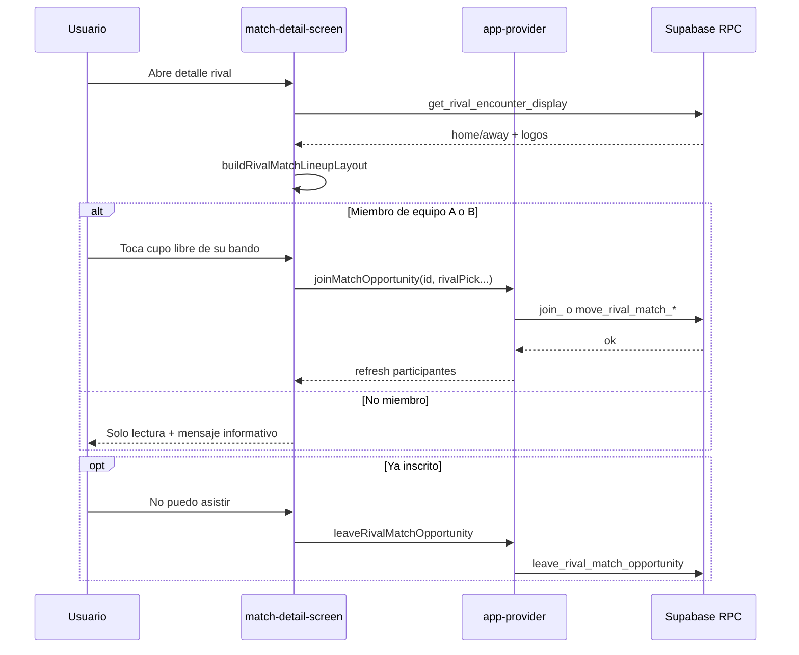

# Documentación: Partido Rival vs Rival — Plantilla en cancha

Documentación de la funcionalidad implementada en **SportMatch (Expo / React Native)** para partidos `type = 'rival'`: visualización del encuentro, plantilla interactiva (6 titulares + suplentes), unión por cupo, cambio de cupo y abandono.

**Última actualización:** mayo 2026  
**Proyecto:** `COPIAconExpo` (app móvil; Supabase compartido con web)

---

## Tabla de contenidos

1. [Resumen ejecutivo](#1-resumen-ejecutivo)
2. [Reglas de negocio](#2-reglas-de-negocio)
3. [Convención de equipos (A / B)](#3-convención-de-equipos-a--b)
4. [Cupos y formación visual](#4-cupos-y-formación-visual)
5. [Modelo de datos](#5-modelo-de-datos)
6. [RLS y visibilidad](#6-rls-y-visibilidad)
7. [Scripts SQL e instalación](#7-scripts-sql-e-instalación)
8. [Funciones SQL (referencia)](#8-funciones-sql-referencia)
9. [Capa cliente (TypeScript)](#9-capa-cliente-typescript)
10. [Componentes UI](#10-componentes-ui)
11. [Flujos de usuario](#11-flujos-de-usuario)
12. [UI del detalle (encuentro)](#12-ui-del-detalle-encuentro)
13. [Códigos de error RPC → mensajes](#13-códigos-de-error-rpc--mensajes)
14. [Diferencias con team_pick](#14-diferencias-con-team_pick)
15. [Checklist de despliegue](#15-checklist-de-despliegue)
16. [Apéndice A — SQL completo (migración plantilla)](#apéndice-a--sql-completo-migración-plantilla)
17. [Apéndice B — SQL RPC escudos públicos](#apéndice-b--sql-rpc-escudos-públicos)

---

## 1. Resumen ejecutivo

| Área | Qué se hizo |
|------|-------------|
| **Visual** | Tarjeta VS con escudos, venue, fecha y contador de inscritos; cancha dual con formación 1-2-2-1 y hasta 3 suplentes por bando. |
| **Inscripción** | Tocar un círculo libre del **propio equipo** para ocupar ese cupo (`lineup_slot`). |
| **Capitanes** | Al crear el desafío, el capitán local queda inscrito automáticamente (equipo **A**). Al aceptar, el capitán visita en equipo **B**. |
| **Movimiento** | Participantes pueden cambiar a otro cupo libre del mismo bando. |
| **Salida** | Botón «No puedo asistir» libera el cupo. |
| **Arquero** | Cada bando debe mantener al menos un arquero; el servidor valida al moverse. |
| **Público** | Cualquier usuario autenticado puede **ver** detalle y escudos; solo **miembros** de los dos equipos pueden inscribirse. |
| **BD** | Columna `lineup_slot`, índice único por cupo, 4 RPCs (`join`, `move`, `leave`, `get_rival_encounter_display`). |

---

## 2. Reglas de negocio

### Quién puede ver

- Cualquier jugador autenticado que llegue al detalle del partido (`match_opportunities`) puede ver nombres, escudos, plantilla y participantes.
- **No** puede tocar cupos si no pertenece a ninguno de los dos equipos del desafío.

### Quién puede unirse / moverse

- Solo usuarios con membresía activa (`team_members` en estado `confirmed`, `pending` o `invited`) en el equipo **local (A)** o **visita (B)** del `rival_challenges`.
- Solo cupos del **propio bando** (`pick_team` A o B).
- Partido en estado `pending` o `confirmed`, fecha no pasada, cupo destino libre, bando no lleno (`players_needed / 2` por equipo; por defecto **9** si `players_needed = 18`).

### Organizador / capitán

- El creador del partido **no** queda bloqueado para rival: se inscribe como participante con cupo fijo al crear.
- Capitán y jugadores del equipo siguen las mismas reglas de cupo (solo su bando).

### Arquero obligatorio

- Si el único arquero del bando intenta salir del cupo `gk` sin que otro ocupe arquero, la RPC `move_rival_match_lineup_slot` devuelve `team_needs_goalkeeper`.

### Elegir bando A/B en rival

- **No** hay selector manual A/B como en `team_pick_*`.
- El bando se infiere por pertenencia al equipo local o visita (`resolveUserRivalPickTeam`).

---

## 3. Convención de equipos (A / B)

| Bando | UI | Origen en BD |
|-------|-----|----------------|
| **A** | Arriba (local) | `rival_challenges.challenger_team_id` |
| **B** | Abajo (visita) | `COALESCE(accepted_team_id, challenged_team_id)` |

Participantes guardan `pick_team = 'A' | 'B'` en `match_opportunity_participants`.

---

## 4. Cupos y formación visual

### Titulares (cancha) — formación 1-2-2-1

| `lineup_slot` | Rol visual |
|---------------|------------|
| `gk` | Arquero |
| `def_0`, `def_1` | Defensa |
| `med_0`, `med_1` | Mediocampista |
| `del` | Delantero |

### Suplentes (si `perSideMax > 6`)

| `lineup_slot` | Rol asignado al unirse |
|---------------|------------------------|
| `bench_0`, `bench_1`, `bench_2` | `mediocampista` (solo cupo visual) |

- Fila **SUPL** arriba → equipo **A**
- Cancha en el centro
- Fila **SUPL** abajo → equipo **B**
- Círculos vacíos siempre visibles en modo `rival6Bench`

### Capacidad

- `match_opportunities.players_needed` = total ambos bandos (p. ej. **18** → **9 por equipo**).
- `perSideMax = floor(players_needed / 2)`.

---

## 5. Modelo de datos

### Tabla `match_opportunity_participants` (columna nueva)

```sql
lineup_slot text  -- gk | def_0 | def_1 | med_0 | med_1 | del | bench_0 | bench_1 | bench_2
```

Campos ya existentes usados en rival:

- `pick_team` — `'A'` o `'B'`
- `encounter_lineup_role` — `'gk' | 'defensa' | 'mediocampista' | 'delantero'`
- `is_goalkeeper` — sincronizado con rol al moverse

### Índice único

```sql
CREATE UNIQUE INDEX idx_mop_rival_lineup_slot_unique
  ON match_opportunity_participants (opportunity_id, pick_team, lineup_slot)
  WHERE lineup_slot IS NOT NULL
    AND status IN ('pending', 'confirmed');
```

### Tablas relacionadas

- `match_opportunities` — partido (`type = 'rival'`, `players_needed`, etc.)
- `rival_challenges` — equipos del desafío
- `teams` — `name`, `logo_url`
- Storage bucket `team-logos` — `{teamId}/logo` (URL pública)

---

## 6. RLS y visibilidad

### Problema detectado (Android vs iOS)

La política `rival_challenges_select_related` solo permite leer el desafío a **miembros** de los equipos (o capitanes / admin). Un espectador sin equipo:

- **No** lee `rival_challenges` vía PostgREST directo.
- El cliente caía al título parseado `"Equipo A vs Equipo B"` y mostraba `DEFAULT_AVATAR` (foto genérica) en lugar de escudos.

### Solución

RPC **`get_rival_encounter_display`** con `SECURITY DEFINER`: devuelve nombres y `logo_url` de ambos equipos para cualquier usuario autenticado que abra un partido rival, sin depender de membresía.

El cliente llama esta RPC **primero**; si falla (migración no aplicada), usa fallback con `resolveTeamLogoDisplayUrl` (Storage público).

---

## 7. Scripts SQL e instalación

Ejecutar en **Supabase → SQL Editor** (una vez por entorno).

| Orden | Archivo | Contenido |
|-------|---------|-----------|
| 1 | `scripts/rival-lineup-join-migration.sql` | Columna, índice, helpers, `join` / `move` / `leave`, `get_rival_encounter_display` |
| 2 (opcional si ya corriste 1 sin el bloque final) | `scripts/rival-encounter-display-rpc.sql` | Solo `get_rival_encounter_display` |

> Si instalas desde cero, **solo necesitas el archivo 1** (ya incluye la RPC de escudos al final).

Tras ejecutar:

```sql
NOTIFY pgrst, 'reload schema';
```

(o esperar recarga automática de PostgREST).

---

## 8. Funciones SQL (referencia)

### Helpers internos (no llamar desde cliente)

| Función | Propósito |
|---------|-----------|
| `_rival_valid_lineup_slot(text)` | Valida cupo permitido |
| `_rival_team_id_for_pick(text, uuid, uuid, uuid)` | Resuelve `team_id` desde bando A/B |
| `_rival_assert_team_member(uuid, uuid)` | Comprueba membresía |
| `_rival_side_has_goalkeeper(uuid, text, uuid)` | ¿Hay arquero en el bando? |

### RPC públicas (`authenticated`)

#### `join_rival_match_opportunity`

```text
(p_opportunity_id uuid, p_pick_team text, p_lineup_slot text, p_encounter_lineup_role text)
→ jsonb { ok: true } | { ok: false, error: "<código>" }
```

- Nuevo participante (no debe existir fila previa).
- Valida miembro del equipo del bando, cupo libre, bando no lleno, partido abierto.

#### `move_rival_match_lineup_slot`

```text
(p_opportunity_id uuid, p_lineup_slot text, p_encounter_lineup_role text)
→ jsonb
```

- Participante ya inscrito; mantiene su `pick_team`.
- Valida arquero obligatorio al abandonar `gk`.

#### `leave_rival_match_opportunity`

```text
(p_opportunity_id uuid) → jsonb
```

- `DELETE` de la fila del usuario en `match_opportunity_participants`.

#### `get_rival_encounter_display`

```text
(p_opportunity_id uuid) → jsonb
```

Respuesta exitosa (ejemplo):

```json
{
  "ok": true,
  "home": { "teamId": "uuid", "name": "Equipo local", "logoUrl": "https://..." },
  "away": { "teamId": "uuid", "name": "Equipo visita", "logoUrl": null },
  "mode": "direct",
  "challengeStatus": "accepted",
  "awaitingRival": false,
  "perSideMax": 9
}
```

---

## 9. Capa cliente (TypeScript)

### Supabase / dominio

| Archivo | Responsabilidad |
|---------|-----------------|
| `lib/supabase/rival-match-detail.ts` | `fetchRivalEncounterDetail` (RPC + fallback), `fetchRivalParticipantTeamIds` |
| `lib/supabase/rival-lineup-actions.ts` | Wrappers RPC + `insertRivalCreatorParticipant` |
| `lib/supabase/join-match-opportunity.ts` | Si `opp.type === 'rival'`: `join` o `move` según si ya participa |
| `lib/supabase/team-logos.ts` | `resolveTeamLogoDisplayUrl`, `teamLogoPublicStorageUrl`, `isPlaceholderAvatarUrl` |
| `lib/supabase/message-queries.ts` | Lee `lineup_slot` en participantes |
| `lib/rival-lineup-slot.ts` | Cupos, `resolveUserRivalPickTeam`, validaciones UI |
| `lib/match-lineup-slots.ts` | `buildRivalMatchLineupLayout`, modo `rival6Bench` |

### Estado global

| Archivo | Métodos relevantes |
|---------|-------------------|
| `lib/app-provider.tsx` | `createRivalChallenge`, `acceptRivalOpportunityWithTeam`, `joinMatchOpportunity`, `leaveRivalMatchOpportunity` |

#### `createRivalChallenge`

1. Inserta `match_opportunities` (`players_needed: 18`, `players_joined: 1`).
2. `insertRivalCreatorParticipant` — capitán en **A**, cupo según posición de perfil.
3. Inserta `rival_challenges`.

#### `acceptRivalOpportunityWithTeam`

1. Actualiza desafío a `accepted`.
2. `insertRivalCreatorParticipant` con `pickTeam: 'B'` para capitán visita.

#### `joinMatchOpportunity` (rival)

```typescript
options?: {
  rivalPickTeam?: 'A' | 'B'
  rivalLineupSlot?: string
  rivalEncounterRole?: 'gk' | 'defensa' | 'mediocampista' | 'delantero'
}
```

- Si ya está en `participatingOpportunityIds` → `moveRivalMatchLineupSlot`.
- Si no → `joinRivalMatchLineupSlot`.

---

## 10. Componentes UI

| Componente | Rol |
|------------|-----|
| `components/rival-match-encounter.tsx` | Tarjeta VS, venue, meta, contador inscritos |
| `components/match-pitch-lineup.tsx` | Cancha dual + suplentes; taps en cupos rival |
| `components/match-detail-screen.tsx` | Orquesta carga, `canRivalPickSlot`, leave, hints |
| `components/rival-team-picker-modal.tsx` | Aceptar desafío abierto (sin cambios de plantilla aquí) |

### Eliminados / no usar en rival

- `rival-match-pitch-banner.tsx` (eliminado)
- `rival-match-participants.tsx` (eliminado)

---

## 11. Flujos de usuario



---

## 12. UI del detalle (encuentro)

### Tarjeta encuentro (`RivalMatchEncounter`)

| Elemento | Comportamiento |
|----------|----------------|
| Escudos | Visibles para todos; `expo-image` + fallback escudo si error |
| Contador | Solo `"N jugadores inscritos"` (sin cupo 18 / 9 por equipo) |
| Texto eliminado | ~~"Esperando que un equipo rival acepte el desafío."~~ |
| Sección cupos 4/18 | Oculta en rival (solo en otros tipos de partido) |

### Plantilla

| Estado | Mensaje hint |
|--------|----------------|
| Puede inscribirse | Toca círculo libre de tu equipo |
| Ya inscrito | Toca otro círculo libre para cambiar de cupo |
| Miembro, bando lleno | Tu equipo ya no tiene cupos libres |
| No miembro | Puedes ver la plantilla; solo miembros pueden ocupar cupos |

---

## 13. Códigos de error RPC → mensajes

Mapeo en `lib/supabase/rival-lineup-actions.ts` (`mapError`):

| Código SQL | Mensaje usuario (ES) |
|------------|----------------------|
| `not_team_member` | Solo puedes usar cupos de tu equipo. |
| `slot_taken` | Ese cupo ya está ocupado. |
| `side_full` | Tu equipo ya no tiene cupos libres. |
| `team_needs_goalkeeper` | Tu equipo debe tener siempre un arquero… |
| `not_participant` | No estás inscrito en este encuentro. |
| `not_open` | Este encuentro ya no admite cambios. |
| `past` | Este partido ya pasó. |
| (función no existe) | Falta aplicar migración `rival-lineup-join-migration.sql` |

Otros códigos (`already_participant`, `invalid_pick_team`, etc.) muestran mensaje genérico de servidor.

---

## 14. Diferencias con team_pick

| | `team_pick_*` | `rival` |
|--|---------------|---------|
| Elegir bando | Usuario elige A/B | Por membresía al equipo |
| RPC unión | `join_team_pick_match_opportunity` | `join_rival_match_opportunity` |
| Cupo | Rol en formación | `lineup_slot` concreto |
| Código privado | Sí (`team_pick_private`) | No |
| Plantilla UI | `standard6` | `rival6Bench` si >6 por bando |

---

## 15. Checklist de despliegue

- [ ] Ejecutar `scripts/rival-lineup-join-migration.sql` en Supabase producción/staging
- [ ] Verificar bucket `team-logos` público para lectura de escudos
- [ ] Probar con usuario **no miembro**: debe ver escudos (RPC) y no poder tocar cupos
- [ ] Probar crear desafío: capitán aparece en plantilla bando A
- [ ] Probar aceptar desafío: capitán visita en bando B
- [ ] Probar mover cupo y salir con «No puedo asistir»
- [ ] Partidos legacy sin `lineup_slot`: participantes siguen en plantilla por fallback de roles (sin slot fijo hasta que se muevan)

---

## Apéndice A — SQL completo (migración plantilla)

Archivo canónico en el repo:

**`scripts/rival-lineup-join-migration.sql`**

```sql
-- Ejecutar en Supabase SQL Editor (una vez).
-- Cupos visuales rival: unirse, cambiar cupo y salir (solo miembros del equipo).

ALTER TABLE public.match_opportunity_participants
  ADD COLUMN IF NOT EXISTS lineup_slot text;

COMMENT ON COLUMN public.match_opportunity_participants.lineup_slot IS
  'Cupo visual rival: gk|def_0|def_1|med_0|med_1|del|bench_0|bench_1|bench_2';

CREATE UNIQUE INDEX IF NOT EXISTS idx_mop_rival_lineup_slot_unique
  ON public.match_opportunity_participants (opportunity_id, pick_team, lineup_slot)
  WHERE lineup_slot IS NOT NULL
    AND status IN ('pending', 'confirmed');

-- ---------------------------------------------------------------------------
-- Helpers internos
-- ---------------------------------------------------------------------------
CREATE OR REPLACE FUNCTION public._rival_valid_lineup_slot(p_slot text)
RETURNS boolean
LANGUAGE sql
IMMUTABLE
AS $$
  SELECT lower(trim(coalesce(p_slot, ''))) IN (
    'gk', 'def_0', 'def_1', 'med_0', 'med_1', 'del',
    'bench_0', 'bench_1', 'bench_2'
  );
$$;

CREATE OR REPLACE FUNCTION public._rival_team_id_for_pick(
  p_pick_team text,
  p_challenger_team_id uuid,
  p_accepted_team_id uuid,
  p_challenged_team_id uuid
)
RETURNS uuid
LANGUAGE sql
IMMUTABLE
AS $$
  SELECT CASE
    WHEN upper(trim(p_pick_team)) = 'A' THEN p_challenger_team_id
    ELSE COALESCE(p_accepted_team_id, p_challenged_team_id)
  END;
$$;

CREATE OR REPLACE FUNCTION public._rival_assert_team_member(p_team_id uuid, p_user_id uuid)
RETURNS boolean
LANGUAGE sql
STABLE
AS $$
  SELECT EXISTS (
    SELECT 1 FROM public.team_members tm
    WHERE tm.team_id = p_team_id
      AND tm.user_id = p_user_id
      AND tm.status IN ('confirmed', 'pending', 'invited')
  );
$$;

CREATE OR REPLACE FUNCTION public._rival_side_has_goalkeeper(
  p_opportunity_id uuid,
  p_pick_team text,
  p_exclude_user_id uuid DEFAULT NULL
)
RETURNS boolean
LANGUAGE sql
STABLE
AS $$
  SELECT EXISTS (
    SELECT 1
    FROM public.match_opportunity_participants p
    WHERE p.opportunity_id = p_opportunity_id
      AND p.pick_team = upper(trim(p_pick_team))
      AND p.status IN ('pending', 'confirmed')
      AND (p_exclude_user_id IS NULL OR p.user_id IS DISTINCT FROM p_exclude_user_id)
      AND (
        p.lineup_slot = 'gk'
        OR p.encounter_lineup_role = 'gk'
      )
  );
$$;

-- ---------------------------------------------------------------------------
-- Unirse a un cupo libre (nuevo participante)
-- ---------------------------------------------------------------------------
CREATE OR REPLACE FUNCTION public.join_rival_match_opportunity(
  p_opportunity_id uuid,
  p_pick_team text,
  p_lineup_slot text,
  p_encounter_lineup_role text
)
RETURNS jsonb
LANGUAGE plpgsql
SECURITY DEFINER
SET search_path = public
AS $$
DECLARE
  mo RECORD;
  rc RECORD;
  v_team text := upper(trim(coalesce(p_pick_team, '')));
  v_slot text := lower(trim(coalesce(p_lineup_slot, '')));
  v_role text := lower(trim(coalesce(p_encounter_lineup_role, '')));
  v_required_team uuid;
  v_side_max int;
  v_side_count int;
BEGIN
  IF auth.uid() IS NULL THEN
    RETURN jsonb_build_object('ok', false, 'error', 'not_authenticated');
  END IF;

  IF v_team NOT IN ('A', 'B') THEN
    RETURN jsonb_build_object('ok', false, 'error', 'invalid_pick_team');
  END IF;

  IF v_role NOT IN ('gk', 'defensa', 'mediocampista', 'delantero') THEN
    RETURN jsonb_build_object('ok', false, 'error', 'invalid_encounter_role');
  END IF;

  IF NOT public._rival_valid_lineup_slot(v_slot) THEN
    RETURN jsonb_build_object('ok', false, 'error', 'invalid_lineup_slot');
  END IF;

  SELECT * INTO mo FROM public.match_opportunities WHERE id = p_opportunity_id FOR UPDATE;
  IF NOT FOUND THEN
    RETURN jsonb_build_object('ok', false, 'error', 'not_found');
  END IF;

  IF mo.type IS DISTINCT FROM 'rival'::public.match_type THEN
    RETURN jsonb_build_object('ok', false, 'error', 'not_rival');
  END IF;

  IF mo.status NOT IN ('pending', 'confirmed') THEN
    RETURN jsonb_build_object('ok', false, 'error', 'not_open');
  END IF;

  IF mo.date_time < date_trunc('day', now()) THEN
    RETURN jsonb_build_object('ok', false, 'error', 'past');
  END IF;

  SELECT * INTO rc FROM public.rival_challenges WHERE opportunity_id = p_opportunity_id;
  IF NOT FOUND THEN
    RETURN jsonb_build_object('ok', false, 'error', 'no_challenge');
  END IF;

  v_required_team := public._rival_team_id_for_pick(
    v_team,
    rc.challenger_team_id,
    rc.accepted_team_id,
    rc.challenged_team_id
  );

  IF v_required_team IS NULL THEN
    RETURN jsonb_build_object('ok', false, 'error', 'team_not_ready');
  END IF;

  IF NOT public._rival_assert_team_member(v_required_team, auth.uid()) THEN
    RETURN jsonb_build_object('ok', false, 'error', 'not_team_member');
  END IF;

  v_side_max := GREATEST(1, COALESCE(mo.players_needed, 18) / 2);

  IF EXISTS (
    SELECT 1 FROM public.match_opportunity_participants p
    WHERE p.opportunity_id = p_opportunity_id
      AND p.user_id = auth.uid()
      AND p.status IN ('pending', 'confirmed')
  ) THEN
    RETURN jsonb_build_object('ok', false, 'error', 'already_participant');
  END IF;

  SELECT COUNT(*) INTO v_side_count
  FROM public.match_opportunity_participants p
  WHERE p.opportunity_id = p_opportunity_id
    AND p.pick_team = v_team
    AND p.status IN ('pending', 'confirmed');

  IF v_side_count >= v_side_max THEN
    RETURN jsonb_build_object('ok', false, 'error', 'side_full');
  END IF;

  IF EXISTS (
    SELECT 1 FROM public.match_opportunity_participants p
    WHERE p.opportunity_id = p_opportunity_id
      AND p.pick_team = v_team
      AND p.lineup_slot = v_slot
      AND p.status IN ('pending', 'confirmed')
  ) THEN
    RETURN jsonb_build_object('ok', false, 'error', 'slot_taken');
  END IF;

  IF v_slot = 'gk' AND public._rival_side_has_goalkeeper(p_opportunity_id, v_team, NULL) THEN
    RETURN jsonb_build_object('ok', false, 'error', 'slot_taken');
  END IF;

  INSERT INTO public.match_opportunity_participants (
    opportunity_id,
    user_id,
    status,
    is_goalkeeper,
    pick_team,
    encounter_lineup_role,
    lineup_slot
  )
  VALUES (
    p_opportunity_id,
    auth.uid(),
    'confirmed',
    v_role = 'gk',
    v_team,
    v_role,
    v_slot
  );

  RETURN jsonb_build_object('ok', true);
EXCEPTION
  WHEN unique_violation THEN
    RETURN jsonb_build_object('ok', false, 'error', 'slot_taken');
  WHEN OTHERS THEN
    RETURN jsonb_build_object('ok', false, 'error', 'server', 'message', SQLERRM);
END;
$$;

-- ---------------------------------------------------------------------------
-- Cambiar de cupo (participante ya inscrito, mismo equipo)
-- ---------------------------------------------------------------------------
CREATE OR REPLACE FUNCTION public.move_rival_match_lineup_slot(
  p_opportunity_id uuid,
  p_lineup_slot text,
  p_encounter_lineup_role text
)
RETURNS jsonb
LANGUAGE plpgsql
SECURITY DEFINER
SET search_path = public
AS $$
DECLARE
  mo RECORD;
  rc RECORD;
  cur RECORD;
  v_slot text := lower(trim(coalesce(p_lineup_slot, '')));
  v_role text := lower(trim(coalesce(p_encounter_lineup_role, '')));
  v_required_team uuid;
BEGIN
  IF auth.uid() IS NULL THEN
    RETURN jsonb_build_object('ok', false, 'error', 'not_authenticated');
  END IF;

  IF v_role NOT IN ('gk', 'defensa', 'mediocampista', 'delantero') THEN
    RETURN jsonb_build_object('ok', false, 'error', 'invalid_encounter_role');
  END IF;

  IF NOT public._rival_valid_lineup_slot(v_slot) THEN
    RETURN jsonb_build_object('ok', false, 'error', 'invalid_lineup_slot');
  END IF;

  SELECT * INTO mo FROM public.match_opportunities WHERE id = p_opportunity_id FOR UPDATE;
  IF NOT FOUND OR mo.type IS DISTINCT FROM 'rival'::public.match_type THEN
    RETURN jsonb_build_object('ok', false, 'error', 'not_rival');
  END IF;

  IF mo.status NOT IN ('pending', 'confirmed') THEN
    RETURN jsonb_build_object('ok', false, 'error', 'not_open');
  END IF;

  IF mo.date_time < date_trunc('day', now()) THEN
    RETURN jsonb_build_object('ok', false, 'error', 'past');
  END IF;

  SELECT * INTO rc FROM public.rival_challenges WHERE opportunity_id = p_opportunity_id;
  IF NOT FOUND THEN
    RETURN jsonb_build_object('ok', false, 'error', 'no_challenge');
  END IF;

  SELECT * INTO cur
  FROM public.match_opportunity_participants p
  WHERE p.opportunity_id = p_opportunity_id
    AND p.user_id = auth.uid()
    AND p.status IN ('pending', 'confirmed')
  FOR UPDATE;

  IF NOT FOUND THEN
    RETURN jsonb_build_object('ok', false, 'error', 'not_participant');
  END IF;

  IF cur.pick_team IS NULL OR cur.pick_team NOT IN ('A', 'B') THEN
    RETURN jsonb_build_object('ok', false, 'error', 'invalid_pick_team');
  END IF;

  v_required_team := public._rival_team_id_for_pick(
    cur.pick_team,
    rc.challenger_team_id,
    rc.accepted_team_id,
    rc.challenged_team_id
  );

  IF NOT public._rival_assert_team_member(v_required_team, auth.uid()) THEN
    RETURN jsonb_build_object('ok', false, 'error', 'not_team_member');
  END IF;

  IF cur.lineup_slot IS DISTINCT FROM v_slot
    AND EXISTS (
      SELECT 1 FROM public.match_opportunity_participants p
      WHERE p.opportunity_id = p_opportunity_id
        AND p.pick_team = cur.pick_team
        AND p.lineup_slot = v_slot
        AND p.status IN ('pending', 'confirmed')
        AND p.user_id IS DISTINCT FROM auth.uid()
    )
  THEN
    RETURN jsonb_build_object('ok', false, 'error', 'slot_taken');
  END IF;

  IF v_slot = 'gk'
    AND cur.lineup_slot IS DISTINCT FROM 'gk'
    AND public._rival_side_has_goalkeeper(p_opportunity_id, cur.pick_team, auth.uid())
  THEN
    RETURN jsonb_build_object('ok', false, 'error', 'slot_taken');
  END IF;

  IF (cur.lineup_slot = 'gk' OR cur.encounter_lineup_role = 'gk')
    AND v_slot IS DISTINCT FROM 'gk'
    AND NOT public._rival_side_has_goalkeeper(p_opportunity_id, cur.pick_team, auth.uid())
  THEN
    RETURN jsonb_build_object('ok', false, 'error', 'team_needs_goalkeeper');
  END IF;

  UPDATE public.match_opportunity_participants
  SET
    lineup_slot = v_slot,
    encounter_lineup_role = v_role,
    is_goalkeeper = (v_role = 'gk')
  WHERE opportunity_id = p_opportunity_id
    AND user_id = auth.uid();

  RETURN jsonb_build_object('ok', true);
EXCEPTION
  WHEN unique_violation THEN
    RETURN jsonb_build_object('ok', false, 'error', 'slot_taken');
  WHEN OTHERS THEN
    RETURN jsonb_build_object('ok', false, 'error', 'server', 'message', SQLERRM);
END;
$$;

-- ---------------------------------------------------------------------------
-- Abandonar el encuentro (libera cupo)
-- ---------------------------------------------------------------------------
CREATE OR REPLACE FUNCTION public.leave_rival_match_opportunity(p_opportunity_id uuid)
RETURNS jsonb
LANGUAGE plpgsql
SECURITY DEFINER
SET search_path = public
AS $$
DECLARE
  mo RECORD;
BEGIN
  IF auth.uid() IS NULL THEN
    RETURN jsonb_build_object('ok', false, 'error', 'not_authenticated');
  END IF;

  SELECT * INTO mo FROM public.match_opportunities WHERE id = p_opportunity_id;
  IF NOT FOUND OR mo.type IS DISTINCT FROM 'rival'::public.match_type THEN
    RETURN jsonb_build_object('ok', false, 'error', 'not_rival');
  END IF;

  IF mo.status NOT IN ('pending', 'confirmed') THEN
    RETURN jsonb_build_object('ok', false, 'error', 'not_open');
  END IF;

  IF mo.date_time < date_trunc('day', now()) THEN
    RETURN jsonb_build_object('ok', false, 'error', 'past');
  END IF;

  DELETE FROM public.match_opportunity_participants
  WHERE opportunity_id = p_opportunity_id
    AND user_id = auth.uid();

  IF NOT FOUND THEN
    RETURN jsonb_build_object('ok', false, 'error', 'not_participant');
  END IF;

  RETURN jsonb_build_object('ok', true);
END;
$$;

GRANT EXECUTE ON FUNCTION public.join_rival_match_opportunity(uuid, text, text, text) TO authenticated;
GRANT EXECUTE ON FUNCTION public.move_rival_match_lineup_slot(uuid, text, text) TO authenticated;
GRANT EXECUTE ON FUNCTION public.leave_rival_match_opportunity(uuid) TO authenticated;

-- Detalle público del encuentro (escudos visibles sin ser miembro del equipo)
CREATE OR REPLACE FUNCTION public.get_rival_encounter_display(p_opportunity_id uuid)
RETURNS jsonb
LANGUAGE plpgsql
STABLE
SECURITY DEFINER
SET search_path = public
AS $$
DECLARE
  mo public.match_opportunities%ROWTYPE;
  rc public.rival_challenges%ROWTYPE;
  v_home jsonb;
  v_away jsonb;
  v_per_side int;
  v_away_team_id uuid;
BEGIN
  IF auth.uid() IS NULL THEN
    RETURN jsonb_build_object('ok', false, 'error', 'unauthorized');
  END IF;

  SELECT * INTO mo FROM public.match_opportunities WHERE id = p_opportunity_id;
  IF NOT FOUND OR mo.type IS DISTINCT FROM 'rival'::public.match_type THEN
    RETURN jsonb_build_object('ok', false, 'error', 'not_rival');
  END IF;

  SELECT * INTO rc FROM public.rival_challenges WHERE opportunity_id = p_opportunity_id;
  IF NOT FOUND THEN
    RETURN jsonb_build_object('ok', false, 'error', 'no_challenge');
  END IF;

  v_per_side := GREATEST(1, COALESCE(mo.players_needed, 18) / 2);
  v_away_team_id := COALESCE(rc.accepted_team_id, rc.challenged_team_id);

  SELECT jsonb_build_object(
    'teamId', t.id::text,
    'name', t.name,
    'logoUrl', NULLIF(trim(t.logo_url), '')
  )
  INTO v_home
  FROM public.teams t
  WHERE t.id = rc.challenger_team_id;

  IF v_away_team_id IS NOT NULL THEN
    SELECT jsonb_build_object(
      'teamId', t.id::text,
      'name', t.name,
      'logoUrl', NULLIF(trim(t.logo_url), '')
    )
    INTO v_away
    FROM public.teams t
    WHERE t.id = v_away_team_id;
  END IF;

  RETURN jsonb_build_object(
    'ok', true,
    'home', COALESCE(
      v_home,
      jsonb_build_object(
        'teamId', rc.challenger_team_id::text,
        'name', 'Equipo local',
        'logoUrl', null
      )
    ),
    'away', v_away,
    'mode', rc.mode::text,
    'challengeStatus', rc.status::text,
    'awaitingRival', rc.status = 'pending' AND rc.accepted_team_id IS NULL,
    'perSideMax', v_per_side
  );
END;
$$;

GRANT EXECUTE ON FUNCTION public.get_rival_encounter_display(uuid) TO authenticated;
```

---

## Apéndice B — SQL RPC escudos públicos

Si ya ejecutaste una versión anterior de la migración **sin** el bloque final, puedes aplicar solo:

**`scripts/rival-encounter-display-rpc.sql`**

```sql
-- Escudos y nombres del encuentro rival visibles para quien abre el detalle del partido,
-- aunque no sea miembro de ningún equipo (RLS de rival_challenges no aplica a esta RPC).

CREATE OR REPLACE FUNCTION public.get_rival_encounter_display(p_opportunity_id uuid)
RETURNS jsonb
LANGUAGE plpgsql
STABLE
SECURITY DEFINER
SET search_path = public
AS $$
DECLARE
  mo public.match_opportunities%ROWTYPE;
  rc public.rival_challenges%ROWTYPE;
  v_home jsonb;
  v_away jsonb;
  v_per_side int;
  v_away_team_id uuid;
BEGIN
  IF auth.uid() IS NULL THEN
    RETURN jsonb_build_object('ok', false, 'error', 'unauthorized');
  END IF;

  SELECT * INTO mo FROM public.match_opportunities WHERE id = p_opportunity_id;
  IF NOT FOUND OR mo.type IS DISTINCT FROM 'rival'::public.match_type THEN
    RETURN jsonb_build_object('ok', false, 'error', 'not_rival');
  END IF;

  SELECT * INTO rc FROM public.rival_challenges WHERE opportunity_id = p_opportunity_id;
  IF NOT FOUND THEN
    RETURN jsonb_build_object('ok', false, 'error', 'no_challenge');
  END IF;

  v_per_side := GREATEST(1, COALESCE(mo.players_needed, 18) / 2);
  v_away_team_id := COALESCE(rc.accepted_team_id, rc.challenged_team_id);

  SELECT jsonb_build_object(
    'teamId', t.id::text,
    'name', t.name,
    'logoUrl', NULLIF(trim(t.logo_url), '')
  )
  INTO v_home
  FROM public.teams t
  WHERE t.id = rc.challenger_team_id;

  IF v_away_team_id IS NOT NULL THEN
    SELECT jsonb_build_object(
      'teamId', t.id::text,
      'name', t.name,
      'logoUrl', NULLIF(trim(t.logo_url), '')
    )
    INTO v_away
    FROM public.teams t
    WHERE t.id = v_away_team_id;
  END IF;

  RETURN jsonb_build_object(
    'ok', true,
    'home', COALESCE(
      v_home,
      jsonb_build_object(
        'teamId', rc.challenger_team_id::text,
        'name', 'Equipo local',
        'logoUrl', null
      )
    ),
    'away', v_away,
    'mode', rc.mode::text,
    'challengeStatus', rc.status::text,
    'awaitingRival', rc.status = 'pending' AND rc.accepted_team_id IS NULL,
    'perSideMax', v_per_side
  );
END;
$$;

GRANT EXECUTE ON FUNCTION public.get_rival_encounter_display(uuid) TO authenticated;
```

---

## Índice de archivos del repo

```
scripts/
  rival-lineup-join-migration.sql    # Migración principal (recomendada)
  rival-encounter-display-rpc.sql    # Solo RPC escudos (parche)

lib/
  rival-lineup-slot.ts
  match-lineup-slots.ts
  supabase/
    rival-match-detail.ts
    rival-lineup-actions.ts
    join-match-opportunity.ts
    team-logos.ts
    message-queries.ts

components/
  rival-match-encounter.tsx
  match-pitch-lineup.tsx
  match-detail-screen.tsx
  rival-team-picker-modal.tsx

lib/app-provider.tsx                 # createRivalChallenge, accept, leave, join
```

---

*Fin del documento.*
